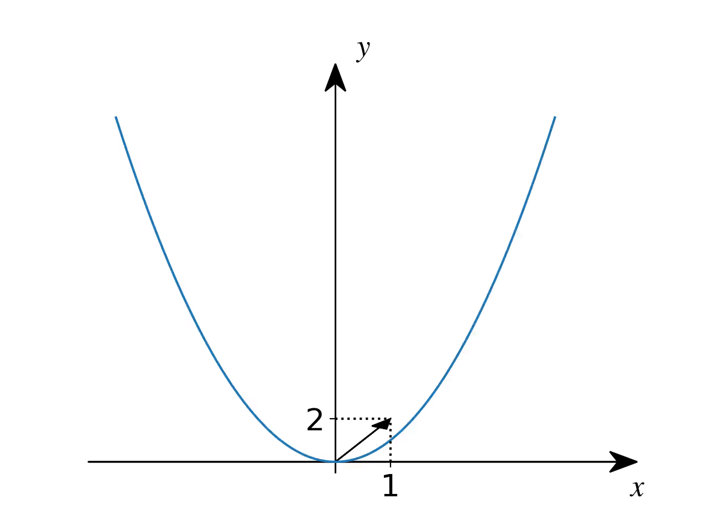

# estudo_em_casa
Plot script for Estudo em Casa maths videos.

## Estrutura
Cada drectorio deve conter o vídeo exportado e o primeiro e último frames com a mesma resolução para incluir nos slides.

## Usagem
O código `doParabolas.sh` cria uma animação de transformação geométrica de uma parábola definida por:
`y0(x)= a0*(x-x0)^2+y0`
em
`y1(x)= a1*(x-x1)^2+y1`
```
./doParabolas.sh nome a1, x1, y1 [-a] [-t]
```
-a: seta de (x0,y0) a (x2,y1)

-t: mostra a escala (x e y)

## Exemplo
```
./doParabolas.sh parabola1 1 1 2 -a
```

para gerar gif:
 ```
 ffmpeg -i parabola1.mp4 -vf palettegen palette.png
 ffmpeg -i parabola1.mp4 -i palette.png -lavfi "paletteuse" parabola1.gif
 ```
